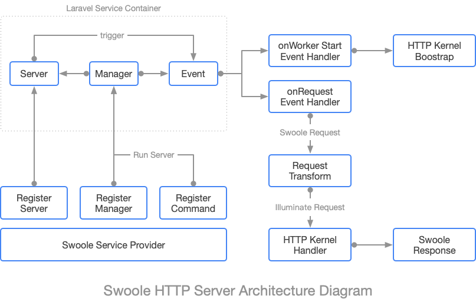

# Swoole Service for Laravel Framework



## Introduction

Swoole is a production-grade async programming framework for PHP. It is a PHP extension written in pure C language, which enables PHP developers to write high-performance, scalable, concurrent TCP, UDP, Unix socket, HTTP, WebSocket services in PHP programming language without too much knowledge about non-blocking I/O programming and low-level Linux kernel. You can think of Swoole as something like NodeJS but for PHP, with higher performance.

Swoole is widely used in many large enterprises in China, such as Baidu, Tencent, Camera 360 and so on. Swoole 2.0 even supports Coroutine, Swoole Coroutine is similar to Coroutine in other languages or frameworks. Swoole creates one coroutine for each request and schedule based on IO status.

## Installation

```bash
composer require betterde/swoole
```

## Configuration

```bash
php artisan vendor:publish --provider Betterde\Swoole\Providers\SwooleServiceProvider
```

modify `swoole.php` in your projecgt config directory

```php
return [
    /*
    |--------------------------------------------------------------------------
    | Web Socket logic controller
    |--------------------------------------------------------------------------
    */
    'im' => [
        'namespace' => 'App\Socket\Controllers',
        'default' => 'DefaultHandler@handler',
    ],

    /*
    |--------------------------------------------------------------------------
    | Users online list cache
    |--------------------------------------------------------------------------
    */
    'online' => [
        'database' => 'status',
        'user_to_session' => [
            'key' => '%s', // 用户UID
            'field' => '%d', // FD
            'value' => '%s-%s' // Client-Version
        ],
        'session_to_user' => 'fd_to_uid',
    ],

    /*
    |--------------------------------------------------------------------------
    | Custom server core logic
    |--------------------------------------------------------------------------
    */
    'multiterminal' => env('WEB_SOCKET_MULTITERMINAL', false),
    'kernel' => \Betterde\Swoole\Server\Kernel::class,
    'events' => \Betterde\Swoole\Server\ServiceEvent::class,
    'dispatcher' => \Betterde\Swoole\Server\Message\Dispatcher::class,
    'status' => \Betterde\Swoole\Server\User\Status::class,
    'custom_controller' => false
];
```
